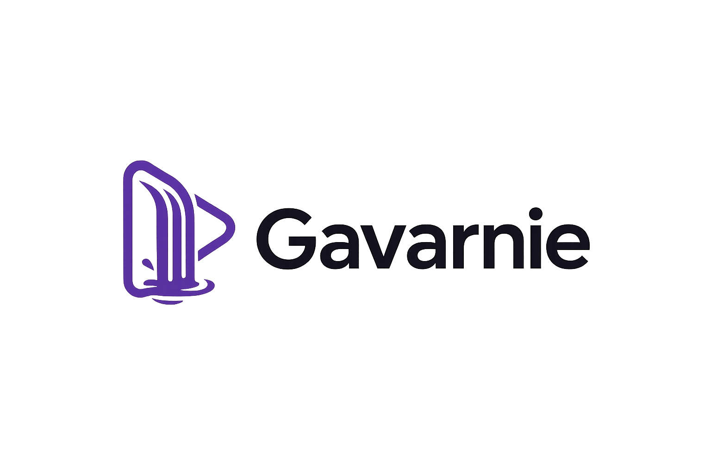

#### 영상,음원 소셜 네트워크 프로젝트 "Gavarnie"

이 서비스의 이름은 프랑스 피레네 산맥에 있는 가장 높은 폭포, Gavarnie(가바니)에서 따왔습니다.
가바니 폭포는 장엄하게 떨어지는 물줄기가 아래로 모여 웅장한 장관을 이루는 것으로 유명한데, 이는 곧 Gavarnie 서비스가 추구하는 방향성과 닮아 있습니다.

#### 🌊모여드는 흐름

폭포에서 떨어지는 수많은 물방울처럼, 각 사용자가 올리는 짧은 영상이나 음원이 하나하나 모여 거대한 흐름을 만듭니다.
개별적인 콘텐츠가 쏟아져 내려 모여드는 과정은 곧 집단적인 에너지와 창의성의 폭발을 상징합니다.

#### 💦쏟아지는 반응

물줄기 옆에서 튀어 오르는 물보라처럼, 콘텐츠에는 사용자들의 좋아요, 댓글, 공유, 반응이 이어집니다.
이는 단순히 흘러가는 물이 아니라, 상호작용과 공감으로 더 큰 파급력을 만들어내는 흐름을 뜻합니다.

#### 🔄끊임없는 순환

폭포는 계속 흘러내리지만 다시 하천과 강으로 이어지고, 또 다른 순환을 만들어갑니다.
Gavarnie 역시 사용자가 만든 콘텐츠와 반응이 새로운 창작과 연결을 낳아, 끊임없이 이어지는 창의적 생태계를 만드는 것을 목표로 합니다.

# Gavarnie (Shorts-style streaming)

Monorepo:

- `apps/api` : NestJS API (업로드/피드/반응/댓글)
- `apps/worker` : NestJS Worker (BullMQ + FFmpeg 파이프라인)
- `web` : React/Next.js (플레이어/업로드/피드)
- `infra` : Docker Compose (MySQL/Mongo/Redis/MinIO/Nginx)
- `libs` : entities, migrations
