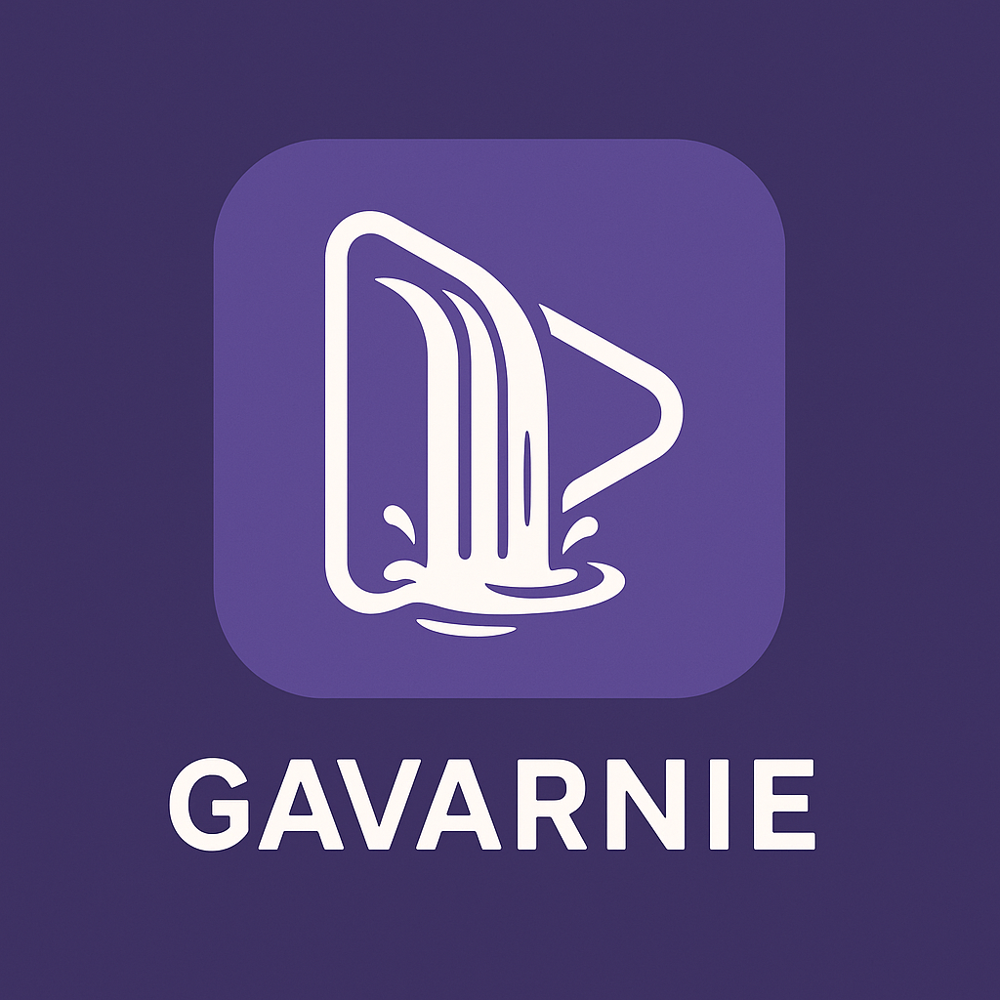

영상 소셜 네트워크 프로젝트 "Gavarnie"

프랑스에서 가장 높은 폭포인 가바니에서 이름을 따온 영상 소셜 네트워크입니다.
폭포에서 떨어진 물이 모이듯, 모든 영상이나 음원과 그에 대한 반응을 볼 수 있는 서비스 입니다.

# Gavarnie (Shorts-style streaming)

Monorepo:

- `apps/api` : NestJS API (업로드/피드/반응/댓글)
- `apps/worker` : NestJS Worker (BullMQ + FFmpeg 파이프라인)
- `web` : React/Next.js (플레이어/업로드/피드)
- `infra` : Docker Compose (MySQL/Mongo/Redis/MinIO/Nginx)

Proceed: 0단계(부트스트랩) → 1단계(인프라) → 2단계(.env) …
